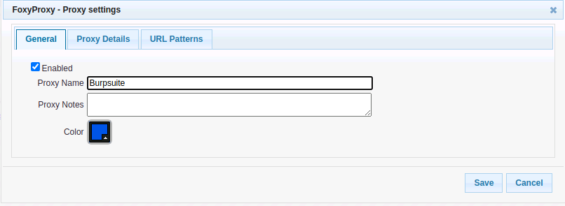
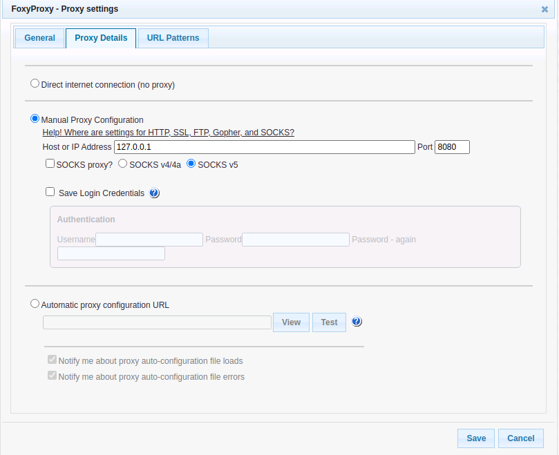
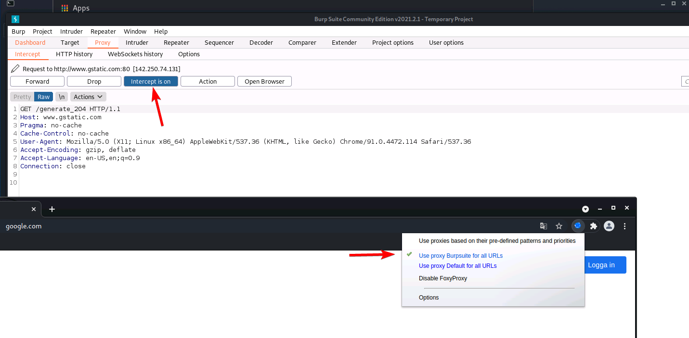
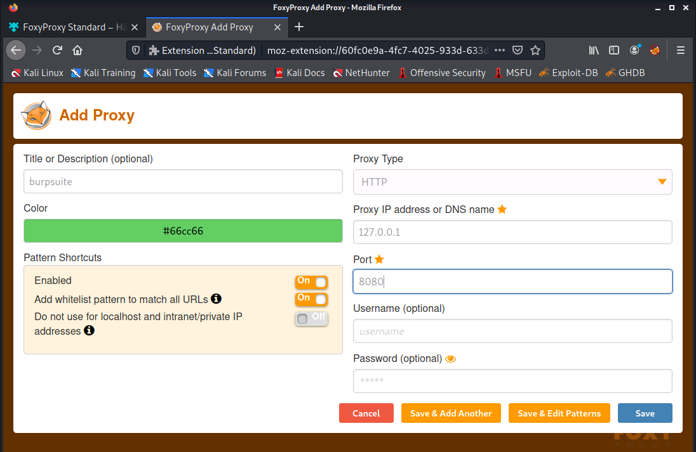

# Foxyproxy
To make it easier to proxy traffic from your browser to Burpsuite, you can install foxyproxy which enables the proxy with a simple click of a button

### Burpsuite certificate
You will encounter SSL errors by default (since the traffic is intercepted) 

Burpsuite has their own guides

1. Chrome https://portswigger.net/burp/documentation/desktop/getting-started/proxy-setup/certificate/chrome
2. Firefox https://portswigger.net/burp/documentation/desktop/getting-started/proxy-setup/certificate/firefox

## Install
1. Google for foxyproxy and find the plugin for your browser
2. Open Foxyproxy and add a new proxy

### Chrome

**Set proxy to localhost and port 8080**

**Enable the proxy for all URLs and make sure intercept is on in burpsuite, try to access a website and the request should show up in burpsuite**

### Firefox
Same methodology as for Chrome, just a litte bit different UI

