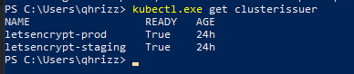
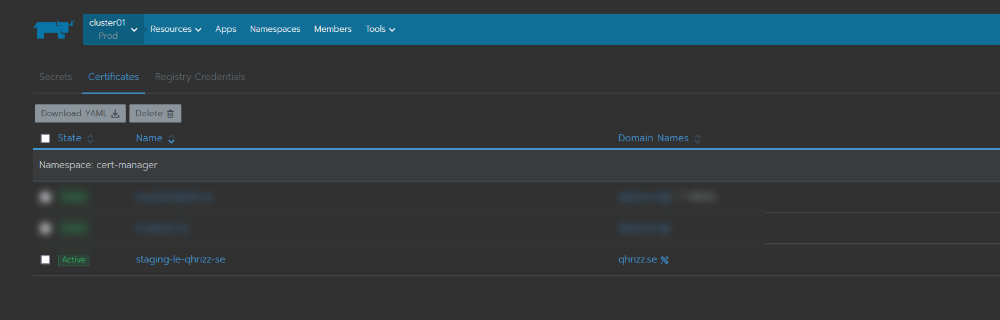
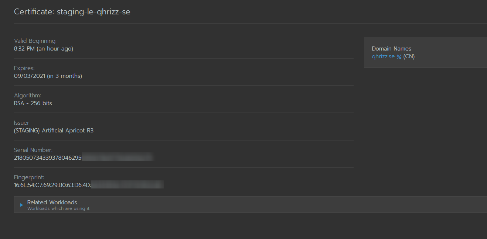

# cert-manager with cloudflare DNS in Rancher
1. Add the catalog https://charts.jetstack.io in Apps

If you would like to, you can use the values.yml at the end of this guide

I have pretty much only added 
```
installCRDs: true
- --dns01-recursive-nameservers=1.1.1.1:53,1.0.0.1:53
- --dns01-recursive-nameservers-only
```


2. Create your cloudflare api token with these permissions

**Permissions:**
- Zone - DNS - Edit
- Zone - Zone - Read

**Zone Resources:**
- Include - All Zones

3. Create a secret in the cert-manager namespace that contains the api secret


```
apiVersion: v1
kind: Secret
metadata:
  name: cloudflare-api-token-secret
  namespace: cert-manager
type: Opaque
stringData:
  api-token: <my cloudflare api token key>
```
4. Now it is time to create our clusterIssuer (non namespace dependent - if you want a normal issuer, change Kind to Issuer)
In this example, I will be using letsencrypt staging. 

This Yaml will create a ClusterIssuer called letsencrypt-staging in the namespace cert-manager

```
apiVersion: cert-manager.io/v1
kind: ClusterIssuer
metadata:
  name: letsencrypt-staging
  namespace: cert-manager
spec:
  acme:
    email: myemail@domain.com
    server: https://acme-staging-v02.api.letsencrypt.org/directory
    # Makes the issuer certificates for available for all namespaces
    issuerRef:
      kind: ClusterIssuer
    privateKeySecretRef:
      # Secret resource that will be used to store the account's private key.
      name: le-staging-issuer-acct-key
    solvers:
    - dns01:
        cloudflare:
          email: myemail@domain.com
          # This is the secret that contains the cloudflare api token
          apiTokenSecretRef:
            name: cloudflare-api-token-secret
            key: api-token
```
This will create the issuer
We can check which ClusterIssuers we have with kubectl get clusterissuer 


5. Now we can try to request a certificate for the domain qhrizz.se using the CluserIssuer letsencrypt-staging
```
apiVersion: cert-manager.io/v1
kind: Certificate
metadata:
  name: staging-le-qhrizz-se
  namespace: cert-manager
spec:
  dnsNames:
    - "qhrizz.se"
  secretName: staging-le-qhrizz-se
  issuerRef:
    name: letsencrypt-staging
    kind: ClusterIssuer
  # Recommended to rotate private key on each renewal
  privateKey:
    rotationPolicy: Always
```

If everything goes to plan we should now have a staging certificate





## Troubleshooting 
If something fails, we can check the request status with 
1. `kubect get certificaterequest --all-namespaces`
2. `kubectl describe certificaterequest [name] -n cert-manager`

To check the certificate itself
1. `kubectl get certificate --all-namespaces`
This should return status = true if everything is OK
2. `kubectl describe certificate staging-le-qhrizz-se -n cert-manager`
This will display a lot more information about the ceritficate and more detailed status

# values.yml
```
# Default values for cert-manager.
# This is a YAML-formatted file.
# Declare variables to be passed into your templates.
global:
  ## Reference to one or more secrets to be used when pulling images
  ## ref: https://kubernetes.io/docs/tasks/configure-pod-container/pull-image-private-registry/
  ##
  imagePullSecrets: []
  # - name: "image-pull-secret"

  # Optional priority class to be used for the cert-manager pods
  priorityClassName: ""
  rbac:
    create: true

  podSecurityPolicy:
    enabled: false
    useAppArmor: true

  # Set the verbosity of cert-manager. Range of 0 - 6 with 6 being the most verbose.
  logLevel: 2

  leaderElection:
    # Override the namespace used to store the ConfigMap for leader election
    namespace: "kube-system"

    # The duration that non-leader candidates will wait after observing a
    # leadership renewal until attempting to acquire leadership of a led but
    # unrenewed leader slot. This is effectively the maximum duration that a
    # leader can be stopped before it is replaced by another candidate.
    # leaseDuration: 60s

    # The interval between attempts by the acting master to renew a leadership
    # slot before it stops leading. This must be less than or equal to the
    # lease duration.
    # renewDeadline: 40s

    # The duration the clients should wait between attempting acquisition and
    # renewal of a leadership.
    # retryPeriod: 15s

installCRDs: true

replicaCount: 1

strategy: {}
  # type: RollingUpdate
  # rollingUpdate:
  #   maxSurge: 0
  #   maxUnavailable: 1

# Comma separated list of feature gates that should be enabled on the
# controller pod.
featureGates: ""

image:
  repository: quay.io/jetstack/cert-manager-controller
  # You can manage a registry with
  # registry: quay.io
  # repository: jetstack/cert-manager-controller

  # Override the image tag to deploy by setting this variable.
  # If no value is set, the chart's appVersion will be used.
  # tag: canary

  # Setting a digest will override any tag
  # digest: sha256:0e072dddd1f7f8fc8909a2ca6f65e76c5f0d2fcfb8be47935ae3457e8bbceb20
  pullPolicy: IfNotPresent

# Override the namespace used to store DNS provider credentials etc. for ClusterIssuer
# resources. By default, the same namespace as cert-manager is deployed within is
# used. This namespace will not be automatically created by the Helm chart.
clusterResourceNamespace: ""

serviceAccount:
  # Specifies whether a service account should be created
  create: true
  # The name of the service account to use.
  # If not set and create is true, a name is generated using the fullname template
  # name: ""
  # Optional additional annotations to add to the controller's ServiceAccount
  # annotations: {}
  # Automount API credentials for a Service Account.
  automountServiceAccountToken: true

# Optional additional arguments
extraArgs:
  # Use this flag to set a namespace that cert-manager will use to store
  # supporting resources required for each ClusterIssuer (default is kube-system)
  # - --cluster-resource-namespace=kube-system
  # When this flag is enabled, secrets will be automatically removed when the certificate resource is deleted
  # - --enable-certificate-owner-ref=true
  # Use this flag to enabled or disable arbitrary controllers, for example, disable the CertificiateRequests approver
  # - --controllers=*,-certificaterequests-approver
  - --dns01-recursive-nameservers=1.1.1.1:53,1.0.0.1:53
  - --dns01-recursive-nameservers-only

extraEnv: []
# - name: SOME_VAR
#   value: 'some value'

resources: {}
  # requests:
  #   cpu: 10m
  #   memory: 32Mi

# Pod Security Context
# ref: https://kubernetes.io/docs/tasks/configure-pod-container/security-context/
securityContext:
  runAsNonRoot: true
# legacy securityContext parameter format: if enabled is set to true, only fsGroup and runAsUser are supported
# securityContext:
#   enabled: false
#   fsGroup: 1001
#   runAsUser: 1001
# to support additional securityContext parameters, omit the `enabled` parameter and simply specify the parameters
# you want to set, e.g.
# securityContext:
#   fsGroup: 1000
#   runAsUser: 1000
#   runAsNonRoot: true

# Container Security Context to be set on the controller component container
# ref: https://kubernetes.io/docs/tasks/configure-pod-container/security-context/
containerSecurityContext: {}
  # capabilities:
  #   drop:
  #   - ALL
  # readOnlyRootFilesystem: true
  # runAsNonRoot: true


volumes: []

volumeMounts: []

# Optional additional annotations to add to the controller Deployment
# deploymentAnnotations: {}

# Optional additional annotations to add to the controller Pods
# podAnnotations: {}

podLabels: {}

# Optional additional labels to add to the controller Service
# serviceLabels: {}

# Optional DNS settings, useful if you have a public and private DNS zone for
# the same domain on Route 53. What follows is an example of ensuring
# cert-manager can access an ingress or DNS TXT records at all times.
# NOTE: This requires Kubernetes 1.10 or `CustomPodDNS` feature gate enabled for
# the cluster to work.
# podDnsPolicy: "None"
# podDnsConfig:
#   nameservers:
#     - "1.1.1.1"
#     - "8.8.8.8"
#podDnsPolicy: "None"
#podDnsConfig:
#  nameservers:
#    - "1.1.1.1"
#    - "1.0.0.1"

nodeSelector: {}

ingressShim: {}
  # defaultIssuerName: ""
  # defaultIssuerKind: ""
  # defaultIssuerGroup: ""

prometheus:
  enabled: true
  servicemonitor:
    enabled: false
    prometheusInstance: default
    targetPort: 9402
    path: /metrics
    interval: 60s
    scrapeTimeout: 30s
    labels: {}

# Use these variables to configure the HTTP_PROXY environment variables
# http_proxy: "http://proxy:8080"
# https_proxy: "https://proxy:8080"
# no_proxy: 127.0.0.1,localhost

# expects input structure as per specification https://kubernetes.io/docs/reference/generated/kubernetes-api/v1.11/#affinity-v1-core
# for example:
#   affinity:
#     nodeAffinity:
#      requiredDuringSchedulingIgnoredDuringExecution:
#        nodeSelectorTerms:
#        - matchExpressions:
#          - key: foo.bar.com/role
#            operator: In
#            values:
#            - master
affinity: {}

# expects input structure as per specification https://kubernetes.io/docs/reference/generated/kubernetes-api/v1.11/#toleration-v1-core
# for example:
#   tolerations:
#   - key: foo.bar.com/role
#     operator: Equal
#     value: master
#     effect: NoSchedule
tolerations: []

webhook:
  replicaCount: 1
  timeoutSeconds: 10

  strategy: {}
    # type: RollingUpdate
    # rollingUpdate:
    #   maxSurge: 0
    #   maxUnavailable: 1

  # Pod Security Context to be set on the webhook component Pod
  # ref: https://kubernetes.io/docs/tasks/configure-pod-container/security-context/
  securityContext:
    runAsNonRoot: true

  # Container Security Context to be set on the webhook component container
  # ref: https://kubernetes.io/docs/tasks/configure-pod-container/security-context/
  containerSecurityContext: {}
    # capabilities:
    #   drop:
    #   - ALL
    # readOnlyRootFilesystem: true
    # runAsNonRoot: true

  # Optional additional annotations to add to the webhook Deployment
  # deploymentAnnotations: {}

  # Optional additional annotations to add to the webhook Pods
  # podAnnotations: {}

  # Optional additional annotations to add to the webhook MutatingWebhookConfiguration
  # mutatingWebhookConfigurationAnnotations: {}

  # Optional additional annotations to add to the webhook ValidatingWebhookConfiguration
  # validatingWebhookConfigurationAnnotations: {}

  # Optional additional arguments for webhook
  extraArgs: []

  resources: {}
    # requests:
    #   cpu: 10m
    #   memory: 32Mi

  ## Liveness and readiness probe values
  ## Ref: https://kubernetes.io/docs/concepts/workloads/pods/pod-lifecycle/#container-probes
  ##
  livenessProbe:
    failureThreshold: 3
    initialDelaySeconds: 60
    periodSeconds: 10
    successThreshold: 1
    timeoutSeconds: 1
  readinessProbe:
    failureThreshold: 3
    initialDelaySeconds: 5
    periodSeconds: 5
    successThreshold: 1
    timeoutSeconds: 1

  nodeSelector: {}

  affinity: {}

  tolerations: []

  # Optional additional labels to add to the Webhook Pods
  podLabels: {}

  image:
    repository: quay.io/jetstack/cert-manager-webhook
    # You can manage a registry with
    # registry: quay.io
    # repository: jetstack/cert-manager-webhook

    # Override the image tag to deploy by setting this variable.
    # If no value is set, the chart's appVersion will be used.
    # tag: canary

    # Setting a digest will override any tag
    # digest: sha256:0e072dddd1f7f8fc8909a2ca6f65e76c5f0d2fcfb8be47935ae3457e8bbceb20

    pullPolicy: IfNotPresent

  serviceAccount:
    # Specifies whether a service account should be created
    create: true
    # The name of the service account to use.
    # If not set and create is true, a name is generated using the fullname template
    # name: ""
    # Optional additional annotations to add to the controller's ServiceAccount
    # annotations: {}
    # Automount API credentials for a Service Account.
    automountServiceAccountToken: true

  # The port that the webhook should listen on for requests.
  # In GKE private clusters, by default kubernetes apiservers are allowed to
  # talk to the cluster nodes only on 443 and 10250. so configuring
  # securePort: 10250, will work out of the box without needing to add firewall
  # rules or requiring NET_BIND_SERVICE capabilities to bind port numbers <1000
  securePort: 10250

  # Specifies if the webhook should be started in hostNetwork mode.
  #
  # Required for use in some managed kubernetes clusters (such as AWS EKS) with custom
  # CNI (such as calico), because control-plane managed by AWS cannot communicate
  # with pods' IP CIDR and admission webhooks are not working
  #
  # Since the default port for the webhook conflicts with kubelet on the host
  # network, `webhook.securePort` should be changed to an available port if
  # running in hostNetwork mode.
  hostNetwork: false

  # Specifies how the service should be handled. Useful if you want to expose the
  # webhook to outside of the cluster. In some cases, the control plane cannot
  # reach internal services.
  serviceType: ClusterIP
  # loadBalancerIP:

  # Overrides the mutating webhook and validating webhook so they reach the webhook
  # service using the `url` field instead of a service.
  url: {}
    # host:

cainjector:
  enabled: true
  replicaCount: 1

  strategy: {}
    # type: RollingUpdate
    # rollingUpdate:
    #   maxSurge: 0
    #   maxUnavailable: 1

  # Pod Security Context to be set on the cainjector component Pod
  # ref: https://kubernetes.io/docs/tasks/configure-pod-container/security-context/
  securityContext:
    runAsNonRoot: true

  # Container Security Context to be set on the cainjector component container
  # ref: https://kubernetes.io/docs/tasks/configure-pod-container/security-context/
  containerSecurityContext: {}
    # capabilities:
    #   drop:
    #   - ALL
    # readOnlyRootFilesystem: true
    # runAsNonRoot: true


  # Optional additional annotations to add to the cainjector Deployment
  # deploymentAnnotations: {}

  # Optional additional annotations to add to the cainjector Pods
  # podAnnotations: {}

  # Optional additional arguments for cainjector
  extraArgs: []

  resources: {}
    # requests:
    #   cpu: 10m
    #   memory: 32Mi

  nodeSelector: {}

  affinity: {}

  tolerations: []

  # Optional additional labels to add to the CA Injector Pods
  podLabels: {}

  image:
    repository: quay.io/jetstack/cert-manager-cainjector
    # You can manage a registry with
    # registry: quay.io
    # repository: jetstack/cert-manager-cainjector

    # Override the image tag to deploy by setting this variable.
    # If no value is set, the chart's appVersion will be used.
    # tag: canary

    # Setting a digest will override any tag
    # digest: sha256:0e072dddd1f7f8fc8909a2ca6f65e76c5f0d2fcfb8be47935ae3457e8bbceb20

    pullPolicy: IfNotPresent

  serviceAccount:
    # Specifies whether a service account should be created
    create: true
    # The name of the service account to use.
    # If not set and create is true, a name is generated using the fullname template
    # name: ""
    # Optional additional annotations to add to the controller's ServiceAccount
    # annotations: {}
    # Automount API credentials for a Service Account.
    automountServiceAccountToken: true


```