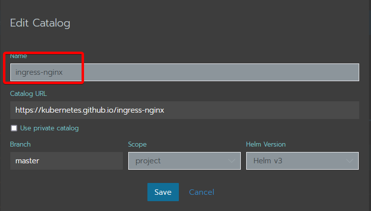
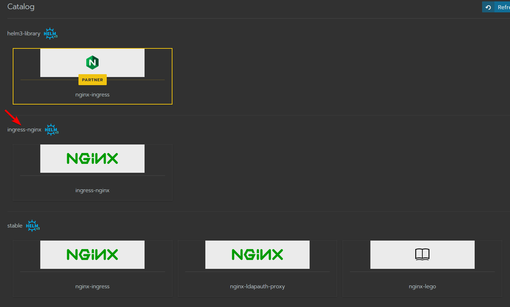

# Nginx Ingress with Rancher
This will describe a simple deployment of nginx-ingress via helmchart and Rancher "forms" together with an ingress class.
The ingress class can help to route the traffic to the correct ingress controller if you have multiple, for example public and internal. 

1. Add the helm chart https://kubernetes.github.io/ingress-nginx, add a name and take note of it 

2. Go to Apps and launch ingress-nginx. Make sure you take the correct chart since there can be multiple! (Look for the name you gave it in step 1) 

3. Fill in the form with
- `controller.ingressClass = internal` (or whatever name you would like)
- (optional if you want to set the default certificate used by the controller) 
`controller.extraArgs.default-ssl-certificate = cert-manager/my-certificate` 
4. Launch!
5. When you create a new ingress/load balancer you need to add the annotation
`kubernetes.io/ingress.class = internal`

To make that ingress go through the controller you just created


## Remote IP address in logs
Add this in the Helm Answer Form

```
controller.service.externalTrafficPolicy = Local
```

This is also recommended from this article https://kubernetes.github.io/ingress-nginx/deploy/baremetal/