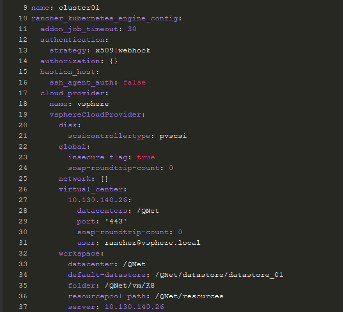
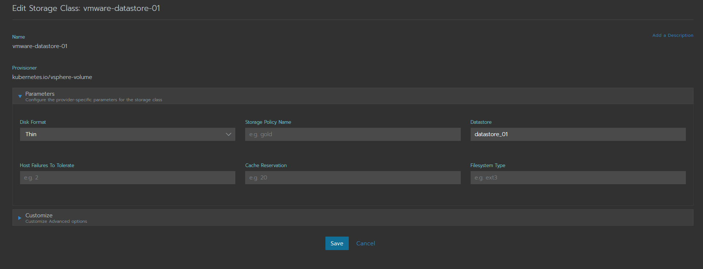
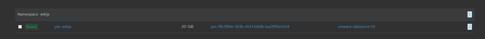
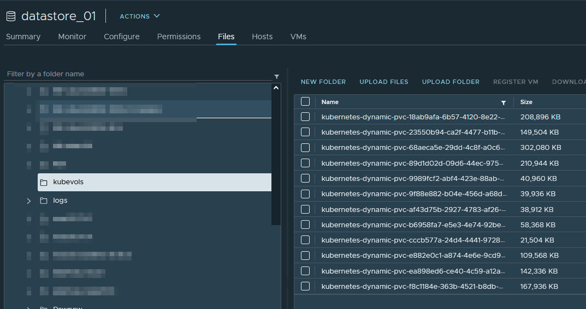

# Guide on how to setup vSphere Storage Class with Rancher


To use Vmware datastores as storage for your Kubernetes/Rancher Cluster you absolutely MUST provision the cluster with a cloud provider. This does not work if you already have the cluster in place, not sure why. Maybe there are other ways but this worked for me :) 

1. Prepare the cloud provider yaml
2. Replace the IP address of Virtual Center with IP or FQDN
3. Replace Username and password (duuh)
4. My datacenter is called “QNet” so replace it this name where appropriate, folder should be where your K8 Nodes reside

```
  cloud_provider:
      name: vsphere
      vsphereCloudProvider:
        disk:
          scsicontrollertype: pvscsi
        global:
          insecure-flag: true
          soap-roundtrip-count: 0
        virtual_center:
          <IP TO vCENTER>:
            datacenters: /QNet
            port: '443'
            soap-roundtrip-count: 0
            user: 'MyServiceAccount@domain.local'
            password: 'MyPassWord'
        workspace:
          datacenter: '/QNet'
          default-datastore: '/QNet/datastore/datastore_01'
          folder: '/QNet/vm/K8'
          resourcepool-path: '/QNet/resources'
          server: 10.130.140.26
```

5. Create a new cluster in Rancher and tick “Custom cloud provider” and the click edit as yaml in the upper right corner
6. Under “rancher_kubernetes_engine_config” paste the before prepared yaml, like this

7. Provision the cluster

8. Once the cluster is done provisioning go to Cluster -> Storage classes and add storage class, switch to Vmware vsphere volume and choose your policies. Save and set as default Storage class. By default if a datastore is not provided it will use the default storage storage class.


9. Once you have created the storage class you can test it by going to your default project/namespace and click volumes
10. Add New Volume -> New Volume Claim -> Set amount of storage and then create. You should now see a bound PVC 


11. If you check vSphere storage you should have a folder named kubevols and your vmdk disk 


12. Done