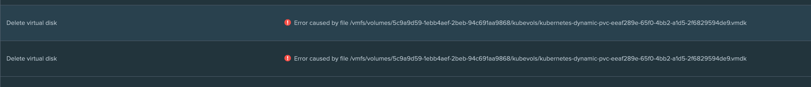

# vSphere storage provider "Error deleting disk in vSphere"
I have had some issues that sometimes the VMware storage provider is unable to delete the storage disk once the PVC is deleted. (mostly when force removing it - guessing there's my problem...)

It would look something like this 

The solution for me was to find the worker node where the disk is attached, detach it and wait and you should see a successful delete
You may have to look through your vSphere storage location for that vmdk and then begin searching for which node (vm) that disk is attached too

Once you do this, it should be OK

