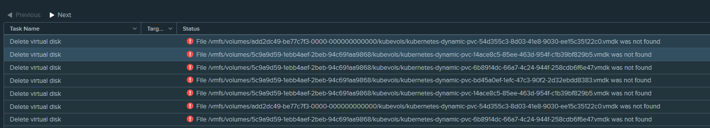
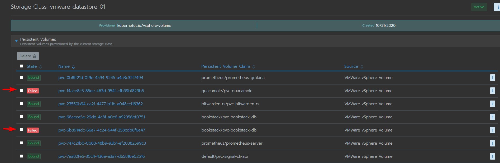

# vSphere storage provider "file not found" when forcibly removed worker node
If you accidently deleted a worker node without draining it, vmware will forcibly remove the vmdk files. This causes issues with Rancher since it thinks there is a vmdk attached which it cannot find now.

1. Log in to rancher and go to your cluster -> Storage classes
2. Choose your storage
3. Locate the failed disks 

4. Delete the disks that are failing, once that is done the error messages in vSphere should disappear