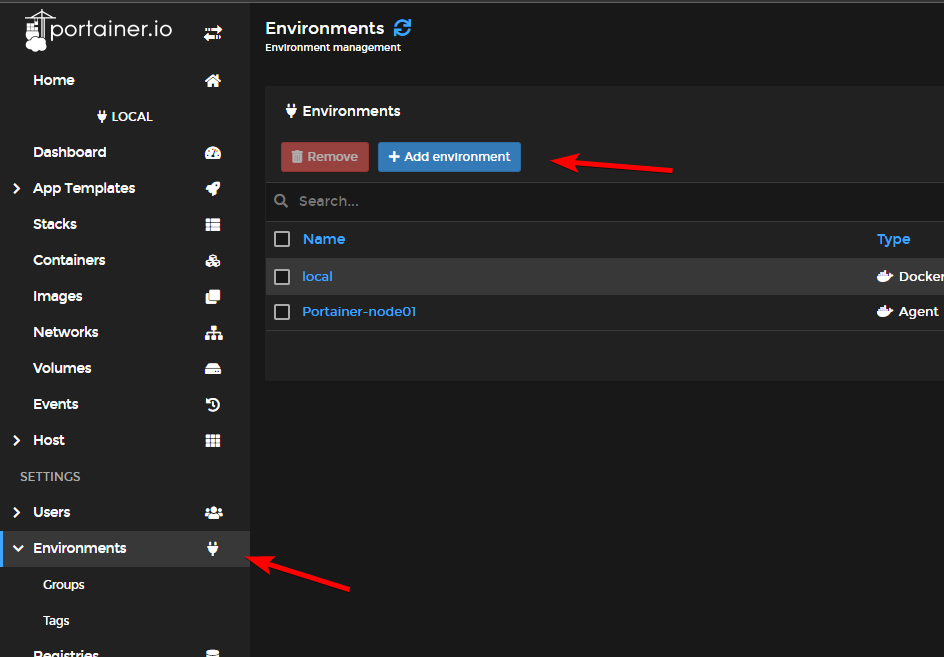
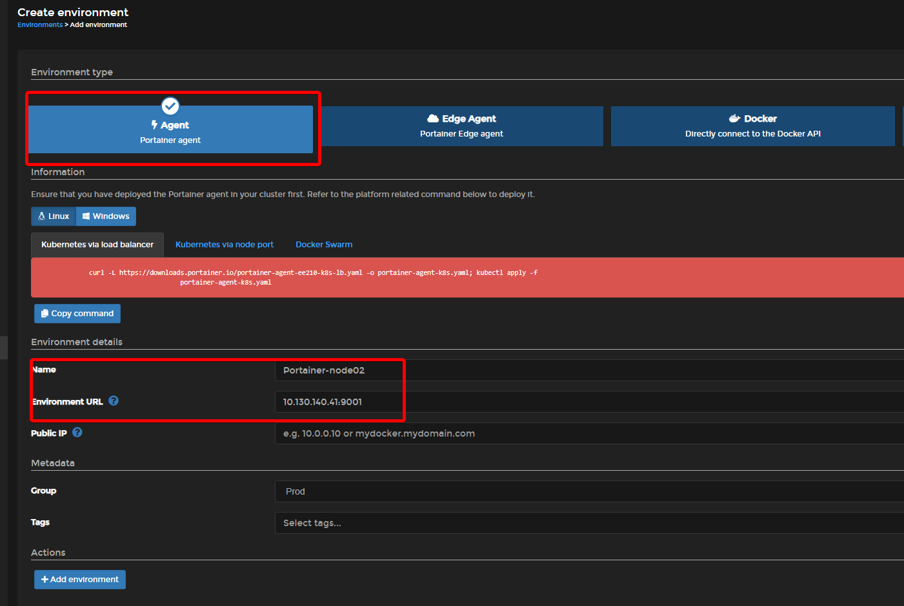

# Guide on how to add portainer agent nodes

1. Create a docker-compose file and add
```
version: '3.3'
services:
    agent:
        ports:
            - '9001:9001'
        container_name: portainer_agent
        restart: always
        volumes:
            - '/var/run/docker.sock:/var/run/docker.sock'
            - '/var/lib/docker/volumes:/var/lib/docker/volumes'
        image: 'portainer/agent:2.10.0'
```

2. Log in to portainer -> Environment -> Add environment



3. Connect to the remote agent


