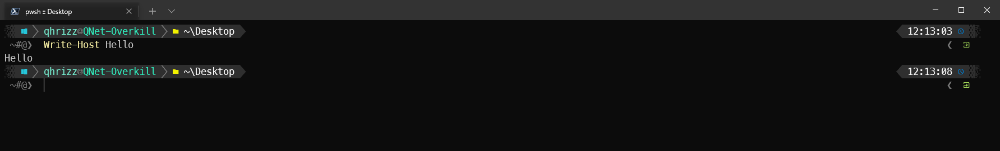
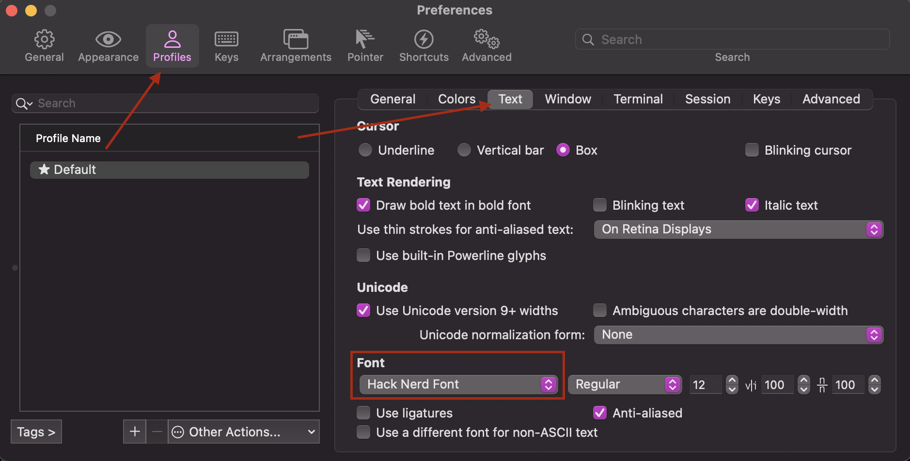

# oh-my-posh
My way of setting it up in Windows Terminal

1. Install modules
```
Install-Module posh-git
Install-Module oh-my-posh 
Install-Module -Name PSReadLine -Force -SkipPublisherCheck
``` 

2. Download Nerd Fonts since most themes requires it
2.1 https://github.com/ryanoasis/nerd-fonts/releases/download/v2.1.0/Meslo.zip 
2.2 Unzip
2.3 Select all and right click -> Install for All users

3. Create and set your profiles (This will overwrite any existing stuff you have!)
```
# Create profile for both PS Core, PS and ISE
$PS7path = "C:\Users\$ENV:USERNAME\Documents\PowerShell\Microsoft.PowerShell_profile.ps1"
$PS5path = "C:\Users\$ENV:USERNAME\Documents\WindowsPowerShell\Microsoft.PowerShell_profile.ps1"
$PS5ISEpath = "C:\Users\$ENV:USERNAME\Documents\WindowsPowerShell\Microsoft.PowerShellISE_profile.ps1"


New-Item -Path $PS7path -Force
New-Item -Path $PS5path -Force
New-Item -Path $PS5ISEpath -Force


# Add
$content = @"
Import-Module posh-git
Import-Module oh-my-posh
Set-PoshPrompt -Theme slimfat
"@

Set-Content -Path $PS7path -Value $content
Set-Content -Path $PS5path -Value $content
Set-Content -Path $PS5ISEpath -Value $content
```
4. Open Windows Terminal settings.json and add 
```
"fontFace": "MesloLGM NF"
```
To your powershell profiles

Example settings.json can be found here https://github.com/qhrizz/Public/blob/master/Windows/Powershell/windows-terminal-settings.json

5. Start Windows terminal. It should look something like this



# macOS
1. Install Fonts with Homebrew
```
brew tap homebrew/cask-fonts
brew install --cask font-hack-nerd-font
```

2. Edit

```
mkdir /Users/USERNAME/.config/powershell (if it doesnt exist)
touch /Users/USERNAME/.config/powershell/Microsoft.PowerShell_profile.ps1
```

4. Add your code. Mine is simply
```
# Load profile from Github
Invoke-Expression ((New-Object System.Net.WebClient).DownloadString('https://raw.githubusercontent.com/qhrizz/Public/master/Windows/Powershell/Profile.ps1'))
```

5. If you use Iterm2, open preferences -> Profiles -> Text -> Font and search for Hack Nerd Font




And your terminal should now look like


# Sync profile
[Sync profile](/wiki/Windows/Setups/Powershell%20Sync%20profile/powershell-sync-profile.html){:target="_blank"}