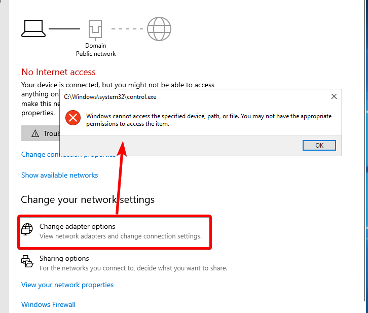
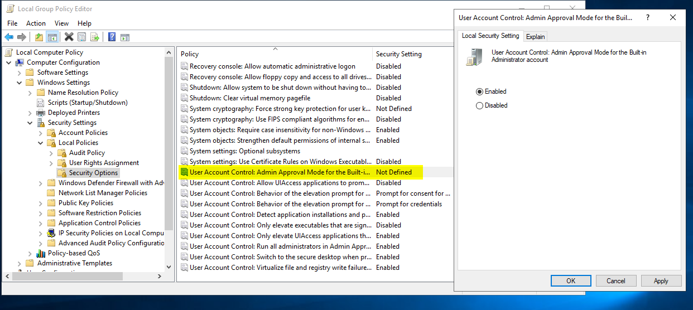

--- 
title: Access denied on network settings
parent: Troubleshooting
grand_parent: Windows
tags: windows, troubleshooting
---

# Network settings access denied

1. Kind of looks like this 

2. Open gpedit.msc and enable as in the screenshot. Reboot

3. Should be resolved
